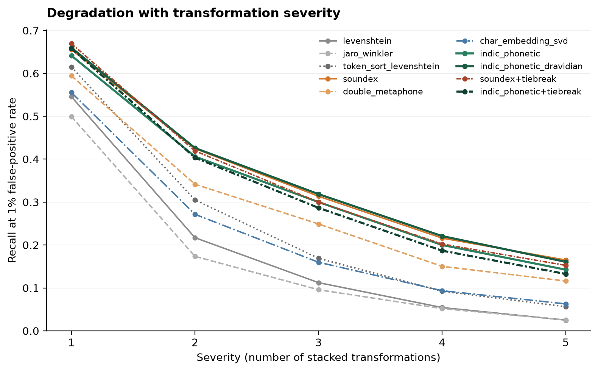
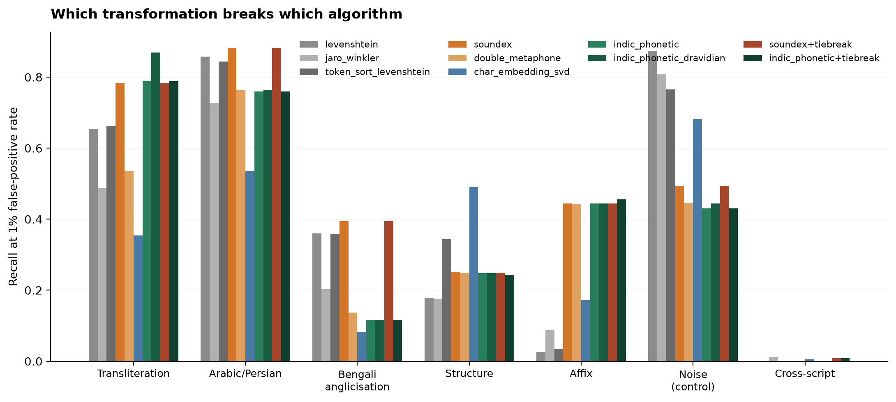
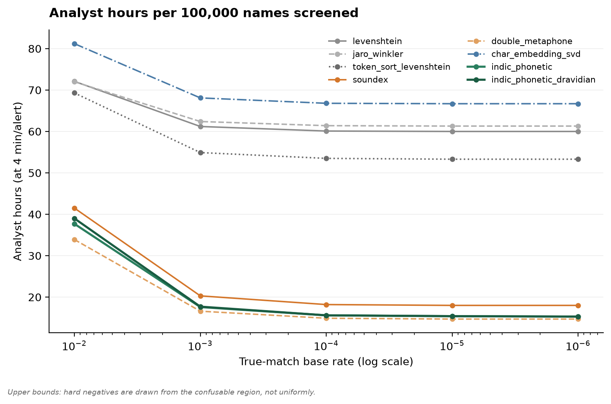
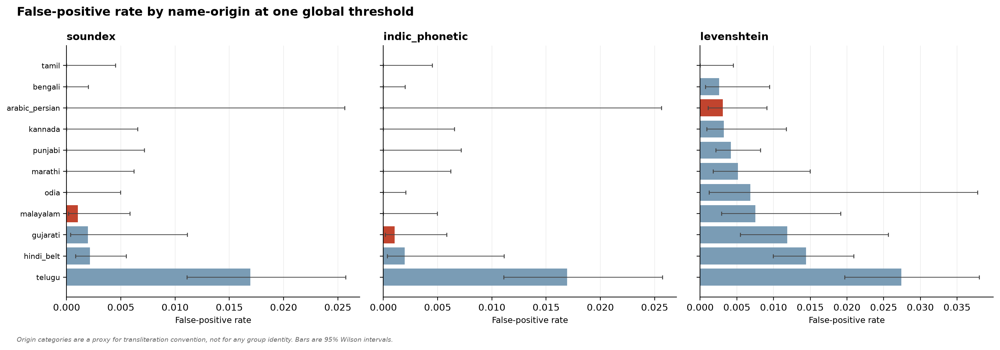

# indic-name-bench

**An open benchmark for fuzzy name matching on Indian names.**

Sanctions, PEP and adverse-media screening runs on Soundex, Metaphone, NYSIIS,
Jaro-Winkler and Levenshtein. That toolkit was designed and tuned on
Anglo-European orthography. Applied to Indian names it degrades in ways that
operations teams feel daily and nobody has published numbers on.

This is the benchmark, the numbers, and the code to reproduce them.

---

## Findings

Full write-up in [`reports/findings.md`](reports/findings.md). The short version:

### 1. The failure is specific, not general

Levenshtein on the **noise** control family — OCR damage, keystroke slips,
separator inconsistency — recovers **87%** of true matches at a 1%
false-positive budget. It is a perfectly competent fuzzy matcher.

The same matcher on the same corpus:

| Transformation family | Levenshtein recall @ 1% FPR |
| --- | --- |
| Noise (control) | **0.874** |
| Transliteration | 0.654 |
| Bengali anglicisation | 0.360 |
| Structure (initials, order, compounds) | 0.179 |
| Affix (honorifics, community suffixes) | **0.026** |
| Cross-script | **0.000** |

The gap between 0.874 and 0.026 is not "fuzzy matching is hard". It is the
toolkit meeting orthography it was not built for.

### 2. Adding "Shri" to a name defeats edit distance almost completely

The affix family — prepending an honorific, adding or dropping Singh/Kaur/Devi,
appending `S/o` — drops Levenshtein to **0.026** and Jaro-Winkler to **0.088**.
Phonetic matchers that strip affixes before comparing hold at ~0.44.

This is the cheapest fix available to anyone running screening today, and it
does not require changing the matching algorithm at all.

### 3. An Indic-adapted phonetic encoder wins where it should, and only there

A purpose-built encoder (consonant skeleton + initial vowel, aspiration as a
diacritic not a consonant, merged coronals and sibilants, `ksh`≡`x`) beats every
English-tuned baseline on transliteration variance:

| Matcher | Transliteration | Arabic/Persian | Bengali anglicisation |
| --- | --- | --- | --- |
| Jaro-Winkler | 0.488 | 0.727 | 0.203 |
| Levenshtein | 0.654 | 0.858 | 0.360 |
| Soundex | 0.783 | 0.882 | 0.394 |
| **Indic phonetic** | **0.789** | 0.760 | 0.117 |
| **Indic phonetic (voicing merged)** | **0.869** | 0.764 | 0.117 |

On the family it was designed for it leads Soundex by 8.6 points and
Jaro-Winkler by 38. On **Bengali anglicisation it is the worst method tested** —
Chatterjee/Chattopadhyay is a historical divergence, not a phonetic one, and no
amount of phonology recovers it. Reported rather than hidden.

### 4. Phonetic matchers score zero at a tight alert budget — and it's a one-line fix

At a **0.1%** false-positive budget every phonetic method scores **0.000**. Not
because the phonology fails: because a code-equality matcher emits only a handful
of distinct scores, so there is no threshold available in that region. Soundex
produces **74 distinct scores** across 31,500 pairs.

Blending in a cheap continuous signal to break ties (Jaro-Winkler at weight 0.15)
fixes it:

| Matcher | Distinct scores | R@0.1% FPR | R@1% FPR | AUC-PR |
| --- | --- | --- | --- | --- |
| soundex | 74 | **0.000** | 0.355 | 0.838 |
| soundex + tiebreak | 15,250 | **0.148** | 0.349 | 0.851 |
| indic_phonetic | 531 | **0.000** | 0.338 | 0.849 |
| indic_phonetic + tiebreak | 17,118 | **0.161** | 0.333 | 0.852 |

Recall at the 1% budget moves by less than 0.006, and AUC-PR *rises*. The
phonology is untouched — only the number of available operating points changes.

Any deployed phonetic screening system reporting zero recall at a tight budget is
threshold-limited, not phonology-limited.

### 5. An alias table buys recall linearly, and nothing generalises

The Indic encoder is worst-in-class on Bengali anglicisation because
Chatterjee/Chattopadhyay is historical, not phonetic. Only a lookup table reaches
it. With 41% of equivalence classes available, Bengali recall goes 0.117 → 0.548;
with the complete table (an **upper bound** — it's the table the corpus was
generated from) 0.958.

Coverage buys recall almost exactly linearly, with **no transfer to unlisted
variants**. Alias-list investment has a predictable return proportional to
coverage and none beyond it — a data-curation budget, not a technology decision.

Table lookup alone reaches 0.958 on Bengali anglicisation and **0.021** on
transliteration; the Indic encoder does the reverse. The two mechanisms are
complementary with disjoint failure modes, and neither substitutes for the other.

### 6. Cross-script matching is a floor of zero

Every Latin-script method scores **0.000** on Devanagari/Bengali/Tamil/Telugu/
Gurmukhi pairs. This is by construction — the strings share no characters — and
it isolates the one capability only a multilingual encoder can have.

### 7. The fairness hypothesis was not confirmed

The pre-registered hypothesis was that name families with higher variant density
(Arabic/Persian above all) would absorb systematically higher false-positive
rates.

**The data does not support this.** At a single global threshold, Arabic/Persian
names showed among the *lowest* false-positive rates (0.0010 for Soundex).
The highest belonged to **Telugu** (0.0169), driven by surname concentration —
Reddy, Rao, Naidu — rather than by spelling variance.

A disparity in false-positive rate across origin categories is real and
substantial (an order of magnitude between the highest and lowest strata). But
the *mechanism* is name-collision density, not variant density, and the
direction is not the one hypothesised. See the limitations section before
citing this.

---

## Figures

| | |
| --- | --- |
|  |  |
|  |  |

---

## Install

```bash
pip install indic-name-bench            # corpus generation, pure stdlib core
pip install indic-name-bench[matchers]  # + jellyfish, rapidfuzz, abydos
pip install indic-name-bench[all]       # + neural, LLM, plotting, dev
```

## Use

```python
from indic_name_bench import corpus
from indic_name_bench.matchers import IndicPhoneticMatcher, encode_token

encode_token("Lakshmi"), encode_token("Laxmi")      # ('LXM', 'LXM')
encode_token("Bhatt"),   encode_token("Batt")       # ('BT',  'BT')
encode_token("Chatterjee"), encode_token("Chattopadhyay")   # ('CTRJ', 'CTPDY') -- honest failure

matcher = IndicPhoneticMatcher()
matcher.score("Ramesh Kumar Sharma", "Ramesh Kumar Sarma")  # 1.000
matcher.score("Ramesh Kumar Sharma", "Ramesh Kumar Verma")  # 0.556
matcher.score("Gurpreet Singh Gill", "Gurpreet Gill")       # 0.889

built = corpus.build(corpus.CorpusConfig(seed=20260811))
```

## Reproduce

```bash
python benchmarks/run_all.py      # every reported number
python benchmarks/make_figures.py # every figure
pytest                            # 107 tests
```

Deterministic from a fixed seed. The manifest records the config, its SHA-256
fingerprint, the library version and the inventory counts.

## Corpus

4,000 synthetic identities → 37,700 labelled pairs across four splits.

| Split | Pairs | Purpose |
| --- | --- | --- |
| `degradation` | 20,000 | mixed-family variants, severity 1–5 |
| `family` | 5,400 | single-family variants, balanced per family |
| `cross_script` | 800 | native-script pairs |
| `negatives` | 11,500 | 5 hard constructions + easy calibration |

Every variant carries the transformation family, rule ids, severity and
normalised edit distance from its seed.

## Data ethics

Every name is synthetic, assembled from an inventory of name **components** —
generic linguistic tokens, not people. **The corpus is deliberately not seeded
from sanctions lists**: those name real individuals, and a machine-generated
variant corpus derived from them would function as a de-facto screening list.
Loaders for the four public lists ship for local regeneration; their output is
gitignored and must not be redistributed.

Full provenance, licences and limitations in [`DATA_SOURCES.md`](DATA_SOURCES.md).

## Limitations

Read these before citing anything above.

- **Frequency tiers are hand-assigned, not measured.** No openly licensed Indian
  name-frequency corpus was reachable. The corpus distribution rests on ordinal
  judgement. This most affects the fairness numbers.
- **Origin categories are a proxy for transliteration convention**, not for
  ethnicity, religion or nationality. 20% of identities carry a surname that
  appears under more than one origin and are flagged `origin_ambiguous`.
- **Synthetic variants may not match real record distributions.** The rules are
  phonotactically constrained but not lexically filtered, so some generated
  forms are plausible-but-unattested.
- **Alert volumes are upper bounds.** Hard negatives are drawn from the
  confusable region, not uniformly, so measured FPR exceeds a uniform draw.
  Relative comparisons between matchers are unaffected.
- **MuRIL, LaBSE and the LLM reranker were not run here.** The environment had
  no access to model weights. Their code paths ship but are unexercised — absent
  from the tables, not scored badly in them.
- **The character-embedding matcher saw the corpus vocabulary** during its
  unsupervised fit. It never saw pair labels, but treat its numbers as a mild
  upper bound.

## Documentation

- [`reports/findings.md`](reports/findings.md) — full results, tables, analysis
- [`METHODOLOGY.md`](METHODOLOGY.md) — the Indic rule set, corpus construction, evaluation design
- [`DATA_SOURCES.md`](DATA_SOURCES.md) — provenance, licences, ethics

## Licence

Apache-2.0 for code. Generated corpus artifacts additionally CC BY 4.0.
