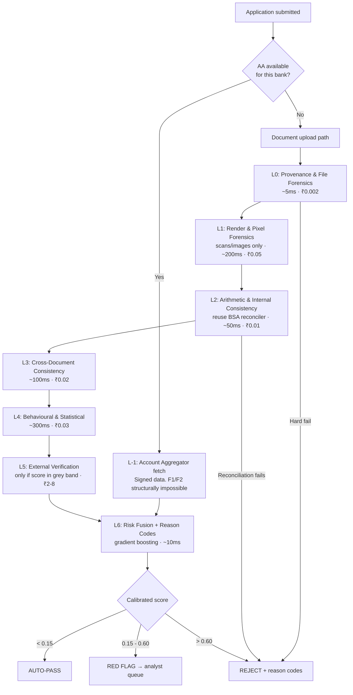

# Golden Dataset & Document-Fraud Detection for BFSI Lending
### Architecture, PRD, Tech Stack, Cost & Timeline — CTO Decision Brief

**Prepared by:** Monika Kushwaha, Tech Lead – AI
**Org:** Timble Technologies
**Version:** 0.9 (Draft for CTO review)
**Date:** August 2026

---

## 0. Executive Summary

We are proposing to build a **Golden Dataset** — a versioned, labelled, adversarially-balanced corpus of authentic and tampered bank statements plus supporting KYC/income documents — and a **layered fraud-detection engine** trained and evaluated on it. The engine returns a calibrated fraud probability plus machine-readable reason codes for every loan application document set, so the NBFC can auto-reject, red-flag, or auto-pass.

**Four things the CTO needs to decide on, before engineering starts:**

| # | Decision | Why it blocks everything |
|---|---|---|
| **D1** | Legal basis for retaining client documents for model training | Timble's contracts promise a stateless, no-storage architecture. Building a dataset from client data **breaks that promise** unless we amend the DPA. DPDP Act has **no "legitimate interest" basis** — consent or contract, nothing else. |
| **D2** | Synthetic-first vs. real-data-first corpus | Determines timeline (6 weeks vs. 6 months) and legal exposure. Recommendation: **synthetic-first**. |
| **D3** | Build vs. buy vs. hybrid | Precisa/Perfios/Digitap already sell this at ~₹100/report. Our build only makes sense as an **embedded capability inside BSA**, not as a standalone product. |
| **D4** | Budget & headcount envelope | Recommended: **₹84 L over 24 weeks, ~6.9 FTE peak** for full production (₹80–95 L range allowing for hiring at market). Lean MVP path: **₹46 L over 14 weeks**, 4 FTE. |

**Headline numbers:**
- Estimated **~12% of bank statements** submitted to Indian NBFCs contain tampering or misrepresentation *(industry estimate — must be validated against our own portfolio before it goes in a board deck)*.
- Banking fraud in India reached ~₹48,000 Cr in FY26, up ~46% YoY, with the large majority originating in advances — i.e. fraud that **cleared loan origination**.
- Target unit economics: **₹2.69 per statement all-in** (including human review), versus ~₹100/report for incumbent vendors. At a ₹30 add-on price and 40% attach rate: **~91% gross margin, ~15-month payback** on the full build, ~8 months on the MVP.
- Expected production performance envelope: **precision ≥ 0.90 at a fixed 2% false-positive rate** on the frozen evaluation set. Not "95% accuracy" — see §8 for why accuracy is a meaningless metric here.

---

## 1. The Blocker You Must Resolve Before Any Code Is Written

This is the single highest-risk item in the entire programme, and it is not technical.

### 1.1 The contradiction

Timble sells to 100+ financial institutions on the strength of a **stateless, no-client-data-storage architecture**. That is a commercial differentiator and almost certainly a written term in the DPA/MSA with each client.

Building a golden dataset means **retaining client bank statements** — which are personal data of the borrower, processed by us on behalf of the lender. The moment we retain them to train our own models, three things change:

1. We are arguably no longer only a **Data Processor**. Using data for our own purpose (product improvement) makes us a **Data Fiduciary** for that processing, with the full obligation set attached.
2. We breach the no-storage term unless amended, which is a **contractual default across every affected client**.
3. Under the DPDP Act, **there is no "legitimate interest" ground**. Unlike GDPR, we cannot argue product improvement as a lawful basis. It must be consent (from the borrower, for this specific purpose) or a statutory ground.

Regulatory timeline: DPDP Rules were notified 13 Nov 2025; full substantive compliance lands **13 May 2027**, with penalties up to ₹250 Cr for security-safeguard failures. Legacy data collected without valid notice and consent is explicitly a focus area. We do not get to build a training corpus quietly in 2026 and regularise it later.

### 1.2 The three-tier data sourcing strategy (recommended)

Do not build the golden dataset out of retained raw client documents. Build it in tiers, with each tier carrying a different legal basis and a different role.

**Tier A — Synthetic Corpus (70–80% of training volume)**
Bank statements generated from scratch: our own templates replicating the layout of the top 40 Indian bank statement formats, populated with statistically realistic synthetic transaction ledgers. Zero PII. Zero legal exposure. Perfect labels — we know exactly what we tampered with and where, down to the pixel and the byte offset.
- *Legal basis:* none required. No personal data.
- *Role:* pre-training, layer development, unlimited augmentation.

**Tier B — Consented Real Corpus (15–25%)**
Real documents from clients who sign a **specific addendum** permitting retention for fraud-model development, with borrower-level consent captured in the lender's own consent flow. De-identified at ingest (names, account numbers, PAN, addresses, phone tokenised via a keyed HMAC held in a separate KMS). Stored in a physically and logically segregated **Data Vault** — separate VPC, separate account, separate encryption keys, no network path to the production stateless pipeline.
- *Legal basis:* consent + amended DPA. Defined retention (recommend 24 months), documented deletion.
- *Role:* fine-tuning, domain adaptation, and the **frozen evaluation set**. This is what closes the synthetic-to-real gap.
- *Realistic yield:* expect 3–8 of 100+ clients to sign. Start the legal conversation in Week 1; it is the long pole.

**Tier C — Derived Features Only (unlimited, at inference time)**
At production inference we already compute a feature vector per statement. Persist **only the non-reversible feature vector + the eventual outcome label** (approved/rejected/defaulted/confirmed-fraud) — no document, no text, no PII. Ensure the feature set is genuinely non-invertible (no raw amounts, no dates, no counterparty strings — only bucketed statistics, ratios, and boolean flags).
- *Legal basis:* argue anonymised/aggregated learnings. **Get this cleared by counsel** — anonymisation claims are frequently overstated, and a feature vector that carries exact balances and dates is re-identifiable.
- *Role:* continuous learning, drift detection, the eventual real-world label supply.

### 1.3 What to hand to Legal in Week 1

- Draft DPA addendum: "Fraud Model Development and Improvement" clause, with purpose limitation, retention period, de-identification standard, deletion SLA, and audit right for the client.
- DPIA covering the Tier B vault.
- Definition of the de-identification standard and the key-management split.
- Retention & deletion schedule with automated enforcement (not a policy document — a cron job with an audit log).

**If Legal says no to Tier B, the programme still runs** — on Tier A + Tier C. Accuracy will be materially lower and it will take longer to prove out, but it is not blocked. Say this explicitly to the CTO so the legal conversation doesn't become a veto.

---

## 2. Problem Framing: What "Fraud" Actually Means Here

"Detect fraud" is too vague to build against. Split it into four classes, because each needs different data, different models, and has different achievable accuracy.

| Class | Description | Detectable from documents alone? | Our scope |
|---|---|---|---|
| **F1. Document tampering** | The PDF/image was edited after issue — balances changed, transactions deleted, salary credits inflated, dates shifted | **Yes, high confidence** | **In scope — primary** |
| **F2. Document fabrication** | The statement was never issued by the bank; generated wholesale from a template or an AI tool | **Yes, moderate-high** | **In scope — primary** |
| **F3. Behavioural / transaction fraud** | The statement is genuine but the *behaviour* is manufactured — circular transactions, round-tripping, synthetic salary credits, mule-account patterns, income structuring before applying | **Partially** | **In scope — secondary** |
| **F4. Identity / consortium fraud** | Real documents, real transactions, wrong person — or a coordinated ring across lenders | **No** — needs external data (bureau, CFR, device, consortium) | **Out of scope v1**, feature hooks only |

**Critical point for the CTO:** even a perfect AA integration only kills F1 and F2. Because AA data comes directly from banks over signed, encrypted APIs, tampering is structurally impossible — but a borrower can still manufacture the *behaviour* in a real account. F3 and F4 survive AA entirely. This is the argument for why our fraud engine has value beyond the industry's AA migration, and it should be stated in the first three slides of any pitch.

### 2.1 Why AA does not make this project redundant

The AA network is large — ~2.6 billion enabled accounts and ~223 million users as of Dec 2025, with 2–5 second fetch. But NBFCs that went AA-only in 2024–25 hit a wall: roughly **62% application failure at the data-collection step** (borrower's bank not AA-enabled), **56% drop-off** when told their bank isn't supported, and a **~38% revenue decline** from losing non-AA customers to competitors still accepting PDFs. Adoption is skewed — ~45–50% in metros versus ~20–30% in Tier 2/3, with cooperative banks, RRBs and small finance banks largely absent.

**Architectural consequence:** AA is Layer −1, not the whole system. Route to AA when available; fall through to the document pipeline when it isn't. The document pipeline is where the fraud lives, precisely because that's the path a fraudster will choose.

---

## 3. System Architecture

### 3.1 Design principle: deterministic-first, cost-cascading

The dominant cost in a document-AI pipeline is the expensive model call and the human reviewer. The dominant *precision* comes from cheap deterministic checks. So order the layers by **cost-per-verdict ascending** and short-circuit as early as possible.

Practically: a large share of forged bank statements in the Indian market are PDFs edited in Acrobat, Foxit, or an online editor. Those leave deterministic, byte-level traces. You do not need a neural network to catch them, and any architecture that starts with a VLM is burning money on cases a 40-line Python function resolves with near-100% precision.

### 3.2 The layers



---

**L−1 · Account Aggregator routing**
If the borrower's bank is AA-enabled and consent is given, fetch via AA. Data arrives digitally signed from the FIP. F1/F2 are eliminated at source. Skip L0–L3 entirely, go straight to L4.
*Why:* it is both the cheapest and the most reliable path. Every application routed through AA is an application we don't spend compute or reviewer time on.
*Provider options:* Finvu, Setu, Anumati, Perfios. Do not build an NBFC-AA licence; integrate a TSP.

**L0 · Provenance & File Forensics** — *deterministic, highest precision, near-zero cost*
Parse the PDF at the byte level, not the render level:
- **Producer/Creator strings** in `/Info` and XMP. A statement from HDFC should carry HDFC's generator signature, not `Adobe Acrobat Pro DC` or `iLovePDF` or `Microsoft Print to PDF`.
- **Incremental save chains** — multiple `%%EOF` markers and `/Prev` cross-reference offsets mean the file was opened and re-saved. Legitimate bank statements are written once.
- **XMP history** (`xmpMM:History`, `DocumentID`, `InstanceID` mismatch) — a direct edit audit trail that most forgers never strip.
- **Object-level anomalies** — orphaned objects, free-list gaps, mismatched generation numbers.
- **Font subset consistency** — a tampered field usually introduces a second subset of the same face, or a fully embedded font where the rest of the page uses a subset.
- **Text-object geometry** — edited amounts frequently sit on a baseline a fraction off the column's, or use a different `Tz`/`Tc` value.
- **Digital signature validation** — increasingly banks sign statements. If signed, verify the chain and byte-range; an invalid signature is a hard reject.
- **Timestamp coherence** — `CreationDate` vs `ModDate` vs the statement period.

*Why this layer first:* it is deterministic, explainable to a regulator in one sentence, costs effectively nothing, and catches the bulk of casual tampering. It also generates the cleanest training labels — anything L0 hard-fails is a confirmed positive we can feed the dataset.

**L1 · Render & Pixel Forensics** — *only for scanned/photographed statements*
Applies when there's no text layer or the document arrived as JPEG/PNG:
- Error Level Analysis, JPEG ghost/double-compression detection, DCT quantisation-table inconsistency
- Noise-residual (SRM / Noiseprint-style) and copy-move detection
- Text-line baseline and character-height consistency across a column
- A fine-tuned segmentation/localisation model producing a **tamper heat-map**, not just a binary score — the analyst needs to see *where*

*Honest assessment — read this before over-investing here:* current published document-forensics models generalise poorly out of distribution. In the DOCFORGE-BENCH zero-shot evaluation across eight document datasets, **no method reached Pixel-F1 ≥ 0.3 on six of eight** datasets, and the dominant failure was *calibration*, not discrimination — methods rank tampered pixels correctly (AUC > 0.90) but have no usable fixed threshold. And on AI-inpainted forgeries specifically (AIForge-Doc), TruFor dropped to AUC 0.751, DocTamper to 0.563, and a zero-shot GPT-4o judge to 0.509 — **chance**.

**Implication:** treat L1 as a *contributing feature into L6*, never as a standalone decision-maker, and calibrate its threshold on our own Tier B data rather than trusting a published threshold. Budget it as the layer most likely to underperform.

**L2 · Arithmetic & Internal Consistency** — *deterministic, near-perfect precision*
This is where we have an unfair advantage: the balance reconciliation work already done in BSA.
- Running balance reconciliation: `opening + Σcredits − Σdebits = closing`, checked at every row, not just page-ends
- Page-boundary continuity — closing balance of page *n* equals opening of page *n+1*
- Date monotonicity and gap detection; missing serial/transaction numbers
- Bank-specific format grammar — IFSC/MICR validity, branch code plausibility, statement-period alignment with the bank's cycle
- Cross-page summary vs. detail agreement

*Why this is the highest-ROI layer:* deleting an unfavourable transaction or inflating a salary credit **breaks the arithmetic** unless the forger recomputes every subsequent balance. Most don't. Precision here approaches 100% with a correctly built reconciler — which is exactly why the `balance_reconcile_v2` anchored-solver work matters commercially, not just as a bug fix.

**L3 · Cross-Document Consistency**
Entity resolution across the application bundle — statement, PAN, Aadhaar/offline eKYC XML, salary slips, Form 16/ITR, GST returns:
- Name matching with Indian-name-aware fuzzy logic (initials, patronymics, transliteration variance, order swaps)
- Account number / IFSC agreement between the statement and the cancelled cheque
- Salary in the slip vs. the salary credit in the statement (amount, date, employer narration)
- ITR/Form-16 income vs. statement-inferred income
- GST turnover vs. business current-account credits
- Aadhaar offline eKYC XML: verify the UIDAI signature — that's deterministic and a hard gate
- PAN: NSDL/Protean verification API

**L4 · Behavioural & Statistical** — *survives AA; the durable moat*
- Benford's-law conformance on transaction amounts (and the first-two-digit variant, which is stronger)
- Round-number density; excessive `.00` endings
- Salary-credit regularity: amount variance, day-of-month variance, narration consistency, employer-name stability
- Balance velocity and window-dressing: sharp balance build-up in the 30–60 days before application
- Circular transactions and round-tripping between a small counterparty set
- Mule-account signatures: high-velocity UPI in/out, dormancy followed by sudden activation, structuring below reporting thresholds
- Counterparty-graph features (if the client permits cross-application graph construction — check the DPA)

**L5 · External Verification** — *expensive, invoke only in the grey band*
- Penny-drop / account validation
- Bank statement fetch API (where the client holds the relationship)
- NSDL PAN verification, UIDAI offline eKYC
- Bureau pull (already in the lender's flow — consume, don't duplicate)
- Negative/hunter database lookup

*Routing rule:* only call L5 when L6's preliminary score sits in the uncertain band. This is the single biggest lever on run cost.

**L6 · Risk Fusion & Reason Codes**
Gradient-boosted trees (XGBoost / LightGBM) over the full feature vector from L0–L5, producing a **calibrated probability** (isotonic or Platt scaling on a held-out set) plus SHAP-derived reason codes.

*Why not an LLM or a deep net for the final decision:* under the RBI Master Directions on Fraud Risk Management for NBFCs, a fraud classification requires a **detailed show-cause notice, a reasonable response window, and a reasoned order** from the board. You cannot serve a reasoned order from an unexplainable model. Gradient boosting with SHAP gives per-decision attribution that maps cleanly to a reason-code taxonomy an analyst can put in writing. It is also faster to train, cheaper to serve, and easier to audit.

*Where an LLM belongs:* generating the human-readable narrative of the analyst case file **from** the reason codes — never producing the codes themselves.

### 3.3 The output contract

Every application returns:
```json
{
  "application_id": "...",
  "decision": "PASS | RED_FLAG | REJECT",
  "fraud_probability": 0.83,
  "confidence_band": "HIGH",
  "reason_codes": [
    {"code": "L0_PRODUCER_MISMATCH", "severity": "CRITICAL", "evidence": {...}, "contribution": 0.41},
    {"code": "L2_BALANCE_RECON_BREAK", "severity": "CRITICAL", "evidence": {"page": 3, "row": 47, "delta": 45000.00}, "contribution": 0.28},
    {"code": "L4_SALARY_IRREGULARITY", "severity": "MEDIUM", "evidence": {...}, "contribution": 0.09}
  ],
  "evidence_bundle_uri": "...",
  "model_version": "fd-engine-1.4.2",
  "dataset_version": "golden-v3.1",
  "processed_at": "..."
}
```

`model_version` + `dataset_version` on every response is non-negotiable. When a decision is challenged twelve months later, we must be able to reconstruct exactly which model and which data produced it.

---

## 4. The Golden Dataset — Specification

This is the actual asset. The models are replaceable; the dataset is the compounding advantage.

### 4.1 Definition

A **versioned, immutable, fully-labelled corpus** of authentic and tampered documents with pixel-level and field-level ground truth, split into training / validation / **frozen evaluation** partitions, governed under a documented schema and change-control process.

### 4.2 Composition targets (v1)

| Segment | Count | Source | Purpose |
|---|---|---|---|
| Authentic synthetic statements | 40,000 | Generated, 40 bank templates × 1,000 | Negative class, template coverage |
| Tampered synthetic statements | 40,000 | Generated with programmatic tamper injection | Positive class, pixel + field masks |
| Authentic real (Tier B, de-identified) | 4,000 | Consented clients | Domain adaptation, realism |
| Confirmed-fraud real | 300–800 | Client fraud registers, historical rejects | **Frozen eval set** — the only ground truth that matters |
| Ambiguous / analyst-disputed | 500 | Analyst queue | Calibration, threshold-setting |
| Supporting docs (PAN/Aadhaar/ITR/slips) | 15,000 | Synthetic + Tier B | L3 cross-consistency |
| Adversarial red-team set | 1,000 | Internal red team, refreshed quarterly | Regression testing against evolving attacks |

The confirmed-fraud real set is small and always will be — that's the nature of the problem. Design around scarcity: use it exclusively for evaluation and calibration, never for training. If you train on 300 confirmed frauds you will overfit to those 300 fraudsters' habits.

### 4.3 Tamper taxonomy for synthetic generation

To detect a manipulation class, the corpus must contain it. Generate across these axes, each with a pixel-level mask and a field-level change record:

**Numeric manipulations** — balance modification (with and without downstream recomputation), transaction amount edits, salary credit inflation, closing balance overwrite.
**Structural manipulations** — transaction deletion, row insertion, page substitution, page reordering, cross-statement splicing.
**Temporal manipulations** — date shifting, statement-period extension, backdating.
**Identity manipulations** — name/address/account-number substitution, branch swap.
**Generation-method axis** *(this is the axis that matters most for generalisation)* —
1. PDF text-object edit (Acrobat-style) — leaves the richest L0 signal
2. Rasterise → image edit → re-embed — destroys L0 signal, needs L1
3. Full regeneration from template — the hardest class, needs L2/L4
4. **AI inpainting** (diffusion/VLM edit) — currently near-undetectable by pixel forensics; must be represented or the model will have a blind spot exactly where the market is heading
5. Print → physically alter → rescan

**Compression/quality axis** — vary JPEG quality and quantisation tables across the corpus. Detectors trained on a narrow quantisation range collapse when the real world hands them something else; deliberate quantisation-table diversity is a known robustness lever.

**Difficulty grading** — label every tampered sample `EASY | MEDIUM | HARD | ADVERSARIAL`. Report metrics per grade. An engine that scores 0.95 overall but 0.4 on ADVERSARIAL is a liability, and a single blended number hides that.

### 4.4 Label schema

```json
{
  "sample_id": "gds_2026_000123",
  "dataset_version": "3.1",
  "tier": "A_SYNTHETIC | B_REAL_CONSENTED | C_ADVERSARIAL",
  "source_bank": "HDFC",
  "document_type": "BANK_STATEMENT",
  "is_authentic": false,
  "fraud_class": ["F1_TAMPERING"],
  "manipulations": [
    {
      "type": "BALANCE_MODIFICATION",
      "generation_method": "PDF_TEXT_EDIT",
      "page": 3,
      "bbox": [412, 288, 498, 302],
      "field": "running_balance",
      "original_value": "45230.00",
      "tampered_value": "245230.00",
      "downstream_recomputed": false
    }
  ],
  "difficulty": "MEDIUM",
  "expected_detecting_layers": ["L0", "L2"],
  "pixel_mask_uri": "s3://.../masks/gds_2026_000123.png",
  "pii_status": "SYNTHETIC_NO_PII",
  "annotator_id": null,
  "annotation_confidence": 1.0,
  "created_at": "2026-09-14T11:20:00Z",
  "split": "TRAIN"
}
```

`expected_detecting_layers` is the field that turns the dataset into a diagnostic instrument. It lets you ask "which layer *should* have caught this, and did it?" — that's how you find out a layer has silently regressed.

### 4.5 Annotation protocol (Tier B only)

- **Two independent annotators + adjudicator** on every real sample. Report Cohen's κ; **halt and retrain annotators if κ < 0.75**.
- Annotators are credit-ops/fraud-analyst profiles, not generic data labellers. Judging whether a salary-credit pattern is manufactured requires domain knowledge.
- Written annotation guideline, version-controlled alongside the data, with worked examples for every edge case encountered.
- Weekly calibration session on a shared gold set of 50 samples.
- **Never let the model pre-label and the human confirm** for evaluation data. Automation bias will silently converge your labels onto your model's errors and your eval set will start certifying its own blind spots.

### 4.6 Governance

- **Versioning:** DVC (or LakeFS) over S3. Every model artefact records the exact dataset hash it trained on.
- **Immutability:** published versions are append-only. Corrections ship as a new version with a documented changelog, never as an in-place edit.
- **Frozen eval set:** physically separated bucket, access-logged, no read access from training pipelines. If an engineer runs eval more than ~20 times against it during development, it's contaminated — enforce this with a query budget, not a policy.
- **Poisoning defence:** the adversarial set is the obvious injection point. All contributions PR-reviewed; anomaly-scan every new batch against the existing distribution before merge.
- **Leakage:** near-duplicate detection (perceptual hash + text shingling) across splits before every release. The same borrower's statement appearing in train and eval is the classic way to ship a model that scores 0.97 offline and 0.6 in production.

---

## 5. Tech Stack

| Layer | Choice | Why this | Alternatives rejected |
|---|---|---|---|
| **PDF parsing** | `pypdf` + `pikepdf` (byte-level) + `pdfplumber` (text/layout) | pikepdf exposes the object graph, xref chain and incremental saves that L0 depends on. pdfplumber gives word-level bounding boxes for geometry checks. Both free. | PyMuPDF — AGPL, licensing friction for a commercial BFSI product. Commercial SDKs — cost without added forensic depth. |
| **OCR (primary)** | Native text-layer extraction | ~70–80% of Indian bank statement PDFs carry a text layer. Extracting it is **free and lossless**. Any pipeline that OCRs everything is burning money. | Always-OCR: wasteful and *less* accurate on text-layer PDFs. |
| **OCR (fallback, scanned)** | Self-hosted **PaddleOCR-VL** or **dots.ocr** (~0.9–3B params) on a single L4/A10G | Purpose-built OCR VLMs now beat frontier generalists on document parsing benchmarks while being ~100–200× cheaper per page self-hosted. Small enough for one GPU. **Data never leaves our VPC** — decisive for BFSI. | Gemini 3 Flash: excellent and cheap (~$0.17/1k pages) but sends client documents to a third-party US endpoint. Keep as a **burst-overflow** option only, and only for Tier A synthetic work. |
| **Structuring** | Small self-hosted LLM (Qwen3-VL / Llama-class 7–8B) or rules-per-template | Two-phase (dedicated OCR → cheap structurer) is reported to cut per-document cost by an order of magnitude versus sending pages to a frontier VLM. For our top ~40 templates, deterministic rules beat any model. | Frontier VLM per page: ~₹11/page and unnecessary. |
| **Pixel forensics** | Fine-tuned ViT / segmentation head, trained on our synthetic corpus + DocTamper-style pretraining | Localisation heat-maps, not just scores. Small enough to serve on CPU or share the OCR GPU. | Off-the-shelf pretrained forensics weights — the zero-shot generalisation evidence is poor. Fine-tune on our own distribution or don't ship it. |
| **Risk fusion** | XGBoost / LightGBM + isotonic calibration + SHAP | Explainability is a **regulatory requirement**, not a nice-to-have. Trains in minutes, serves in <10ms, audits cleanly. Handles tabular mixed-type features better than a neural net at this data scale. | Deep tabular nets: no accuracy gain at ~50k rows, far worse explainability. LLM-as-judge for the decision: unexplainable, non-deterministic, unacceptable to a regulator. |
| **Serving** | FastAPI + Celery + Redis, Docker, EKS | Already Timble's stack; reuses the BSA async job architecture. No new operational surface. | New frameworks — needless retraining cost for the team. |
| **Experiment tracking** | MLflow (self-hosted) | Free, self-hosted, model registry included, ties artefacts to dataset versions. | W&B: excellent but paid and cloud-hosted. |
| **Data versioning** | DVC + S3 | Git-native, minimal ops burden. | LakeFS: better at scale, heavier to run. Revisit past ~1TB. |
| **Annotation** | Label Studio (self-hosted) | Free, supports bbox/mask/document tasks, on-prem for PII. | Scale AI / Labelbox: cost, and Tier B data must not leave our infrastructure. |
| **Evaluation harness** | Extend **TrustLLM** + custom fraud metrics | We already own an evaluation platform. Use it — dogfooding, and it turns TrustLLM into an internally-validated asset. | Building a fourth eval framework from scratch. |
| **Monitoring** | Evidently (drift) + Prometheus/Grafana + Langfuse (for the narrative LLM) | Drift monitoring on the feature distribution is the early warning that fraudsters have adapted. | Manual review: too slow to catch adversarial drift. |

### 5.1 Model selection — the cost argument in one table

Per-page economics for the ~20–25% of documents that actually need OCR:

| Option | Approx. cost/page | Data residency | Verdict |
|---|---|---|---|
| Native text layer | ₹0 | On-prem | **Default. Covers 70–80%.** |
| Self-hosted PaddleOCR-VL / dots.ocr | ₹0.15–0.30 (amortised GPU) | **On-prem** | **Primary fallback** |
| Gemini 3 Flash API | ~₹0.015 | Third-party, US | Burst only, synthetic data only |
| Mistral OCR (managed) | ₹0.09–0.18 | Third-party | Contingency |
| Frontier VLM per page | ₹8–11 | Third-party | **Never in the hot path** |

The self-hosted GPU is *more* expensive per page than Gemini Flash at our volumes. We pay that premium deliberately, for data residency. Make that trade-off explicit to the CTO rather than letting it look like an oversight — and note that at high enough volume the GPU amortises below the API anyway.

---

## 6. Cost Model

Full detail, editable assumptions, and scenario toggles are in the accompanying workbook. Summary:

### 6.1 Build cost (one-time)

| Line | Full Build (24 wks) | Lean MVP (14 wks) |
|---|---|---|
| People (incl. annotators) | ₹55.1 L | ₹31.8 L |
| GPU compute (train + dev serving) | ₹7.0 L | ₹2.5 L |
| Infra, storage, tooling | ₹3.5 L | ₹1.5 L |
| External API (dev/test) | ₹1.8 L | ₹0.8 L |
| Legal / DPIA / external counsel | ₹4.0 L | ₹3.0 L |
| Red team + security review | ₹2.0 L | ₹0 |
| Contingency (15%) | ₹11.0 L | ₹5.9 L |
| **Total** | **₹84.3 L** | **₹45.5 L** |

Driven off person-month allocations in the workbook — adjust the allocations there and every downstream number moves. Present as **₹80–95 L** to leave room for hiring at market rate; the ₹84 L point estimate assumes the ML/Backend and Data Engineer roles are reallocated from BSA rather than net-new hires.

### 6.2 Run cost per statement

| Layer | Trigger rate | Cost when triggered | Weighted |
|---|---|---|---|
| L0 provenance | 100% | ₹0.002 | ₹0.002 |
| L2 arithmetic | 100% | ₹0.01 | ₹0.01 |
| Text extraction | 78% | ₹0 | ₹0 |
| OCR/VLM | 22% | ₹0.60 (3 pg avg) | ₹0.13 |
| L1 pixel forensics | 15% | ₹0.05 | ₹0.008 |
| L4 behavioural | 100% | ₹0.03 | ₹0.03 |
| L5 external verify | 8% | ₹5.00 | ₹0.40 |
| L6 fusion | 100% | ₹0.001 | ₹0.001 |
| Infra overhead | — | — | ₹0.35 |
| **Machine subtotal** | | | **₹0.89** |
| **Human review** | **4%** | **₹45/case** | **₹1.80** |
| **All-in per statement** | | | **₹2.69** |

*(L0/L2/OCR trigger rates in the workbook are net of the 30% of volume routed through AA, which skips those layers entirely.)*

Human review is **67% of run cost**. Every percentage point shaved off the review rate is worth more than any model optimisation — at a 12% review rate the all-in cost triples to ₹6.29. **That is the number to put in front of the CTO, not model accuracy.**

### 6.3 The business case — state it as revenue, not as vendor savings

A tempting but dishonest framing is "we avoid ₹100/report × 50,000/month = ₹5 Cr/year." Timble does not currently pay a vendor per report, so that saving is **notional**. Do not present it as cash flow; a CTO will spot it immediately and it will cost credibility on everything else in the deck.

The defensible case is an add-on line:

| | Monthly | Annual |
|---|---|---|
| Add-on price per screened statement | ₹30 | |
| Attach rate (share of BSA volume) | 40% | |
| Add-on revenue | ₹6.0 L | ₹72.0 L |
| Run cost on attached volume | ₹0.54 L | ₹6.4 L |
| **Gross contribution** | **₹5.5 L** | **₹65.6 L** |
| **Gross margin** | **91%** | |
| **Payback — full build** | | **~15 months** |
| **Payback — lean MVP** | | **~8 months** |

Both price and attach rate need validating with sales before this goes anywhere. They are the two assumptions the whole case rests on.

### 6.4 Cost blowout risks

1. **Review rate above plan.** Modelled at 4%. At 12% (realistic if calibration is poor at launch), all-in cost triples to ~₹6.3. Mitigation: launch conservative in shadow mode, tighten thresholds only on evidence.
2. **L5 trigger rate above plan.** Modelled at 8% and it's the most expensive per-call layer. Cap it with a hard monthly budget and a circuit breaker.
3. **GPU idle.** A dedicated GPU at low volume is dominated by fixed cost. Below ~30k statements/month, use the API path for non-sensitive work and batch the sensitive.

---

## 7. Timeline, Team & Training

### 7.1 Phases

| Phase | Weeks | Deliverable | Gate |
|---|---|---|---|
| **P0 · Legal & Foundation** | 1–3 | DPA addendum drafted, DPIA, Data Vault provisioned, de-identification pipeline | **Counsel sign-off. Hard gate — nothing real-data touches disk before this.** |
| **P1 · Golden Dataset v1** | 2–8 | Synthetic generator (40 templates), tamper injection engine, label schema, DVC repo, 80k samples | Schema review; 500-sample manual QA at ≥98% label accuracy |
| **P2 · Deterministic Layers** | 6–12 | L0, L2, L3 in production-grade code with full test coverage | **Precision ≥ 0.98 on L0/L2 hard-fails.** These must almost never be wrong. |
| **P3 · ML Layers** | 10–16 | L1 pixel model, L4 features, L6 fusion + calibration + SHAP | Recall ≥ 0.75 @ 2% FPR on frozen eval |
| **P4 · Shadow Mode** | 14–20 | Runs on live traffic, decisions logged not enforced, analyst feedback loop live | 4 weeks stable; ≥85% analyst agreement on RED_FLAG |
| **P5 · Production & Monitoring** | 18–24 | Phased enforcement, drift monitoring, quarterly red-team, retraining pipeline | Client sign-off; RBI-aligned audit trail verified |

Phases overlap deliberately. **First real value lands at Week 12** (L0+L2 in shadow), not Week 24 — worth stating, because a 24-week number without that caveat reads as too slow.

### 7.2 Team

| Role | FTE | Weeks | Notes |
|---|---|---|---|
| Tech Lead – AI (you) | 1.0 | 1–24 | Architecture, L6, stakeholder management |
| Senior AI/ML Engineer | 1.0 | 4–20 | L1 pixel forensics, model training |
| ML/Backend Engineer | 1.0 | 2–24 | L0, L2, L3, serving |
| Data Engineer | 1.0 | 1–14 | Synthetic generator, pipelines, DVC |
| MLOps Engineer | 0.5 | 8–24 | EKS, MLflow, monitoring |
| Annotators (contract) | 2.0 | 4–14 | Credit-ops background required |
| Fraud/Credit SME | 0.25 | 1–24 | Ideally from a client; taxonomy validation |
| Legal / DPO | 0.15 | 1–6 | Existing or external counsel |
| **Total** | **~6.9 FTE peak** | | |

### 7.3 Training the team

| Gap | Who | Time | How |
|---|---|---|---|
| PDF internals & forensics | Backend + ML eng | 2 wks | PDF 1.7 spec (object model, xref, incremental update), pikepdf internals, hands-on with a corpus of known-tampered files |
| Document forensics ML | Sr. AI eng | 3 wks | DocTamper / ForensicHub codebases, TruFor, DOCFORGE-BENCH findings on generalisation failure |
| Credit fraud domain | Whole team | 1 wk | SME-led sessions; walk 50 real historical fraud cases end to end |
| Calibration & imbalanced eval | Sr. AI + Lead | 1 wk | Precision@fixed-FPR, PR-AUC, isotonic/Platt calibration, cost-sensitive thresholds |
| DPDP & RBI Fraud Risk Directions | Lead + eng | 3 days | Counsel-led. **Non-optional.** |
| K8s/EKS for model serving | MLOps + Lead | 2 wks | Aligns with your existing 8-week upskilling plan |

**Model training compute:** the ML work here is modest — fine-tuning a ~100M-parameter ViT on 80k images and training gradient-boosted trees. A single A10G/L4 handles the full training cycle in 6–12 hours. **Budget for iteration count, not for scale.** Expect 40–60 training runs across the programme. No multi-GPU cluster required, and anyone proposing one has misread the problem.

---

## 8. Evaluation: The Metrics That Matter

**Never report accuracy.** At a ~12% fraud base rate, a model that predicts "authentic" for everything scores 88% accuracy and is worthless. If accuracy appears in a deck, someone is either confused or selling.

**Primary metrics:**
1. **Precision @ fixed FPR (2%)** — the operating constraint. False positives mean rejecting good borrowers, which costs revenue and generates complaints.
2. **Recall @ fixed FPR** — what proportion of real fraud we catch inside that constraint.
3. **PR-AUC** — threshold-independent, correct for imbalanced classes. Not ROC-AUC, which flatters at low base rates.
4. **Calibration error (ECE)** — a "0.7 probability" must mean 70% of such cases are actually fraud, or downstream thresholds are meaningless.
5. **Per-difficulty breakdown** — EASY/MEDIUM/HARD/ADVERSARIAL, reported separately, always.
6. **Per-bank-template breakdown** — catches the case where we're excellent on HDFC and blind on cooperative banks.
7. **Expected loss (₹)** — the only metric the CTO and the board actually care about:
   `E[loss] = (FN × avg_loan × LGD_fraud) + (FP × avg_margin × rejection_cost)`
   Choose the threshold that minimises this, not the one that maximises F1.

**Acceptance criteria for production:**
- L0/L2 hard-fail precision ≥ 0.98 (these auto-reject; a false positive here is a wrongly-rejected customer)
- Overall recall ≥ 0.75 @ 2% FPR on the frozen eval set
- ADVERSARIAL-grade recall ≥ 0.50 @ 2% FPR
- ECE ≤ 0.05
- 100% of RED_FLAG/REJECT decisions carry ≥ 1 human-readable reason code
- p95 latency ≤ 8s for a 6-page statement

---

## 9. Risks & Future Blockers

### 9.1 Technical

| Risk | Severity | Mitigation |
|---|---|---|
| **Synthetic-to-real domain gap.** Models learn our generator's artefacts, not real forgery. Historically the #1 killer of synthetic-trained forensics systems. | **Critical** | Tier B fine-tuning; frozen eval on real fraud only; generator diversity audits; adversarial validation (train a classifier to separate synthetic from real — if it succeeds easily, the generator isn't good enough) |
| **AI-generated forgeries are near-undetectable today.** Diffusion-inpainted numeric edits pushed TruFor to AUC 0.751, DocTamper to 0.563, GPT-4o to 0.509 (chance). | **Critical, and worsening** | Do not rely on pixel forensics. Weight L0 (provenance) and L2 (arithmetic) — an AI can repaint a number convincingly but rarely recomputes every downstream balance. Push clients toward AA. Include AI-forged samples in the corpus from day one. |
| **Calibration failure.** Published detectors show high AUC with near-zero F1 at fixed thresholds — they rank correctly but have no usable operating point. | High | Calibrate on our own data. Never adopt a published threshold. Isotonic regression on a dedicated calibration split. |
| **Bank template churn.** Banks redesign statement formats without notice; L2 grammar rules break silently. | High | Template-drift monitor on parse-failure rate per bank; automated alerting; quarterly template refresh sprint; graceful degradation to generic parsing |
| **Class imbalance & label scarcity.** Confirmed fraud is a few hundred cases. | High | Synthetic augmentation for training; real data reserved for eval; cost-sensitive learning; focal loss where applicable |
| **Reject inference.** We only learn outcomes for applications that were *approved*. Rejected applicants — including correctly-rejected fraudsters — never generate a label. This biases every retraining cycle. | **High, and structurally unsolvable** | Standard credit-risk techniques (parcelling, augmentation). Hold out a small randomised "approve anyway" cohort if the client tolerates it — this is the only clean fix and most lenders will refuse. **Document the bias explicitly** so nobody mistakes the model for unbiased. |

### 9.2 Legal & regulatory

| Risk | Severity | Mitigation |
|---|---|---|
| **DPA breach from data retention** | **Critical** | P0 gate. No exceptions. |
| **DPDP enforcement (May 2027)** | Critical | Compliance built in from P0, not retrofitted. Programme finishes well ahead. |
| **Adverse-action explainability.** RBI requires show-cause notice + reasoned order for fraud classification. | High | SHAP reason codes; explainable model by design; full decision audit trail with model+dataset version |
| **Cross-border transfer.** Any third-party API call ships client PII abroad. | High | Self-hosted models for anything touching real client data. Non-negotiable. |
| **Discriminatory outcomes.** A model may proxy geography or bank type into a demographic bias — cooperative-bank customers systematically flagged more often. | High | Fairness audit across bank type, region, loan size. Test it; don't assume it away. |
| **SDF designation.** Financial-services entities are likely candidates for Significant Data Fiduciary status, bringing mandatory audits and DPIAs. | Medium | Assume it applies. Build to the higher bar. |

### 9.3 Adversarial & market

| Risk | Severity | Mitigation |
|---|---|---|
| **Adversarial adaptation.** Fraudsters iterate. Any published detection capability becomes a target. | High | Quarterly internal red team; drift monitoring on feature distributions; never publish detection specifics; treat the reason-code taxonomy as confidential |
| **AA adoption erodes the addressable problem** | Medium | F3/F4 (behavioural, identity) survive AA entirely. Position L4 as the durable moat, not L0/L1. |
| **Incumbent competition** (Precisa, Perfios, Digitap, Signzy) with 850+ bank formats and years of head start | Medium | Do not compete head-on. Embed in BSA as a differentiator on an existing distribution channel. Consider vendor + our layer in parallel for 6 months to benchmark honestly. |
| **Dataset poisoning** | Medium | PR review on all contributions; distribution anomaly scan; immutable versioning |
| **Key-person risk.** This concentrates deep, undocumented domain knowledge in 2–3 people. | Medium | Documentation as a deliverable, not an afterthought; pair on the forensics work |

### 9.4 The one I would flag hardest

**If the CTO can only act on one thing:** the AI-forgery detection gap is not a v2 problem. Diffusion-based document editing is already effectively invisible to the state of the art, and it is getting cheaper every quarter. Any architecture whose fraud detection rests on pixel forensics has a shelf life measured in quarters.

The strategic answer is not a better detector. It is **provenance** — AA-first routing, digital signature verification, bank-issued statements over borrower-uploaded ones. Our engine should be explicitly designed as the bridge that covers the non-AA population until AA coverage closes the gap, and the roadmap should say so honestly rather than implying we've solved forgery detection permanently.

---

## 10. Asks

1. **Approve the P0 legal workstream immediately.** It's 3 weeks and it gates everything. It costs almost nothing to start and it's the only true blocker.
2. **Decide D2** — synthetic-first (recommended, faster, no legal exposure) vs. real-data-first.
3. **Approve budget envelope** — ₹80–95 L full build, or ₹46 L for the lean MVP as a proof point first.
4. **Name a client design partner** — one NBFC willing to sign the DPA addendum and supply confirmed-fraud cases. Without this, we ship a system validated only on our own synthetic data, and that is a materially weaker product.
5. **Approve the shadow-mode commitment** — 4 weeks minimum of logged-not-enforced running before any automated rejection reaches a real borrower. This is non-negotiable from a risk standpoint and I'd rather have it agreed up front than argued about at Week 20.

---

*Figures marked as estimates are modelling assumptions, not measured results. Industry statistics are drawn from published 2026 vendor and regulatory reporting and should be independently validated against Timble's own portfolio data before use in any external or board-facing document.*
